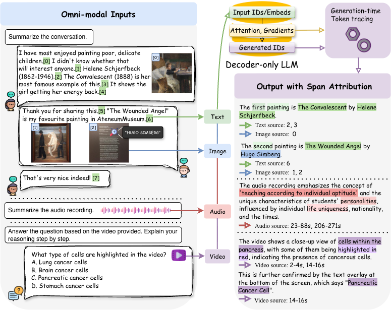

# OmniTrace
This is the official repository for the paper:
**"OmniTrace: A Unified Framework for Generation-Time Attribution in Omni-Modal LLMs"**

[📄 Paper](#) | [🌐 Project Page](#) | [🤗 Demo](#) | [📦 PyPI](https://pypi.org/project/omnitrace/0.1.0/)

## 🧠 Overview

<p align="center">
  
</p>

OmniTrace is a **plug-and-play framework for generation-time attribution** in multimodal large language models (text, image, audio, video).
- Works for **decoder-only multimodal LLMs**
- Supports **text, image, audio, and video**
- Provides **generation-time attribution**
- Plug-and-play across different backends (Qwen, MiniCPM)
- No retraining required

---

## 🚀 Installation

### Option 1: Install from PyPI (recommended)

```bash
pip install omnitrace
```


### Option 2: Install from GitHub (recommended)

```bash
git clone https://github.com/Jackie-2000/OmniTrace.git
cd OmniTrace
pip install -e .
```

## ⚡ Quick Start (Python API)
```python
from omnitrace import OmniTracer

tracer = OmniTracer(
    model_name="qwen",      # or "minicpm"
    method="attmean"        # attribution method, choose from "attmean", "attraw", "attgrads"
)

# visual-text input
sample = {
    "prompt": "Answer the question based on the images provided. Explain your reasoning step by step.",
    "question": [
        {"text": "Is the time shown in clock or watch in both <image> and <image> the same?\n(A) Yes, they are both at 9 o'clock\n(B) Yes, they are both at 12 o'clock\n(C) No, they show different time"},
        {"image": "examples/media/262_0.jpg"},
        {"image": "examples/media/262_1.jpg"}
    ],
}

# audio input
sample = {
    "prompt": "Answer the question based on the audio provided. Explain your reasoning step by step.\n",
    "question": [
        {"text": "What was the last sound in the sequence?\nA. footsteps\nB. dog_barking\nC. camera_shutter_clicking\nD. tapping_on_glass"},
        {"audio": "examples/media/b7701ab1-c37e-49f2-8ad9-7177fe0465e9.wav"}
    ],
}

# video input
sample = {
    "prompt": "Answer the question based on the video provided. Explain your reasoning step by step.\n",
    "question": [
        {"text": "What type of weapon does the slain legend retrieve?\nA. Sword\nB. Axe\nC. Gun\nD. Spear"},
        {"video": "examples/media/6Z_XNM_iT4g.mp4"}
    ],
}

result = tracer.trace(sample)
print(result)
```

### 🖥️ Command Line Usage
Run OmniTrace on a dataset file:
```bash
python scripts/run_demo.py trace \
  --questions_path examples/question_visual_text.json \
  --model_name qwen \
  --method attmean
```

#### 📂 Input Format
The input file should be a JSON list of samples:
```json
[
  {
    "id": 0,
    "prompt": "Answer the question based on the images provided. Explain your reasoning step by step.\n",
    "question": [
        {"text": "Is the time shown in clock or watch in both <image> and <image> the same?\n(A) Yes, they are both at 9 o'clock\n(B) Yes, they are both at 12 o'clock\n(C) No, they show different time"},
        {"image": "examples/media/262_0.jpg"},
        {"image": "examples/media/262_1.jpg"}
    ],
  },
  {
    "id": 1,
    "prompt": "Answer the question based on the audio provided. Explain your reasoning step by step.\n",
    "question": [
        {"text": "What was the last sound in the sequence?\nA. footsteps\nB. dog_barking\nC. camera_shutter_clicking\nD. tapping_on_glass"},
        {"audio": "examples/media/b7701ab1-c37e-49f2-8ad9-7177fe0465e9.wav"}
    ],
  },
  {
    "id": 2,
    "prompt": "Answer the question based on the video provided. Explain your reasoning step by step.\n",
    "question": [
        {"text": "What type of weapon does the slain legend retrieve?\nA. Sword\nB. Axe\nC. Gun\nD. Spear"},
        {"video": "examples/media/6Z_XNM_iT4g.mp4"}
    ],
  },
]
```

## 🧩 Supported Modalities

OmniTrace supports multimodal inputs with the following structure:

### 🔹 Text + Image (Interleaved)
You can provide **multiple text and image inputs**, interleaved:

| Field    | Description                  |
|----------|------------------------------|
| `text`   | Input text (string or list)  |
| `image`  | Path(s) to image(s)          |

Example:
```json
{
    "prompt": "Summarize the conversation.\n",
    "question": [
        { "text": "<TURN> \"I have most enjoyed painting poor, delicate children. I didn't know whether that will interest anyone.\" - Helene Schjerfbeck (1862-1946). The Convalescent (1888) is her most famous example of this. It shows the girl getting her energy back."},
        {"image": "examples/media/-288980723939800020.jpg"},
        {"text": "<TURN> Thank you for sharing this. 'The Wounded Angel' is my favourite painting in AteneumMuseum"},
        {"image": "examples/media/8846049217870534914.jpg"},
        {"image": "examples/media/-4402135406098345009.jpg"},
        {"text": "<TURN> That's a very nice indeed!"}
    ],
}
```

---

### 🔹 Audio/Video

| Field    | Description                  |
|----------|------------------------------|
| `audio`  | Path to a single audio/video file  |
| `question` / `text` | Prompt related to the audio/video |

Example:
```json
{
    "question": [
        {"text": "What was the last sound in the sequence?\nA. footsteps\nB. dog_barking\nC. camera_shutter_clicking\nD. tapping_on_glass"},
        {"audio": "examples/media/b7701ab1-c37e-49f2-8ad9-7177fe0465e9.wav"}
    ],
}
{
    "question": [
        {"text": "What type of weapon does the slain legend retrieve?\nA. Sword\nB. Axe\nC. Gun\nD. Spear"},
        {"video": "examples/media/6Z_XNM_iT4g.mp4"}
    ],
}
```

### ⚠️ Notes

- **Text + Image** supports multiple inputs and interleaving.
- **Audio and Video** currently support **only one file per sample**.
- Each sample should include a prompt (`text` or `question`) describing the task.

---

## ⚙️ Arguments

### `--questions_path`
Path to input JSON file.

### `--model_name`
Supported:
- `qwen`
- `minicpm`

### `--method`
Attribution method:
- `attmean`
- `attraw`
- `attgrads`

---

## 📁 Example Files

We provide ready-to-run examples:

```bash
examples/question_visual_text.json
examples/question_audio.json
examples/question_video.json
```

---

## 🧪 Minimal Test

Run this to verify everything works:

```bash
python scripts/run_demo.py trace \
  --questions_path examples/question_visual_text.json \
  --model_name qwen \
  --method attmean
```

---

## 📊 Attribution Performance

**Attribution performance across omni-modal models and tasks.**  
OT<sub>AttMean</sub>, OT<sub>RawAtt</sub>, and OT<sub>AttGrads</sub> denote OmniTrace instantiated with mean-pooled attention, raw attention, and gradient-based scoring signals, respectively.  
$\dagger$ indicates results not reported due to computational constraints.  
$\times$ indicates the method is not applicable.

---

### Qwen2.5-Omni-7B

| Method | Text F1 (Summ.) | Image F1 (Summ.) | Image F1 (QA) | Time F1 (Audio Summ.) | Time F1 (Audio QA) | Time F1 (Video QA) |
|--------|----------------|------------------|---------------|----------------------|--------------------|--------------------|
| **OT<sub>AttMean</sub>** | **75.66** | **76.59** | 56.60 | **83.12** | **49.90** | **40.16** |
| OT<sub>RawAtt</sub> | 72.51 | 51.82 | **65.44** | 76.69 | 47.64 | 36.53 |
| OT<sub>AttGrads</sub> | 67.70 | 42.24 | 65.02 | † | 47.56 | † |
| Self-Attribution | 9.25 | 40.60 | 61.03 | 4.43 | 29.01 | 13.67 |
| Embed<sub>processor</sub> | 17.30 | 14.55 | 36.88 | × | × | × |
| Embed<sub>CLIP</sub> | 17.20 | 3.54 | 6.32 | × | × | × |
| Random | 10.98 | 8.38 | 24.70 | × | × | × |

---

### MiniCPM-o 4.5-9B

| Method | Text F1 (Summ.) | Image F1 (Summ.) | Image F1 (QA) | Time F1 (Audio Summ.) | Time F1 (Audio QA) | Time F1 (Video QA) |
|--------|----------------|------------------|---------------|----------------------|--------------------|--------------------|
| OT<sub>AttMean</sub> | 30.57 | 75.43 | 37.00 | 33.52 | **46.94** | **22.85** |
| **OT<sub>RawAtt</sub>** | **37.32** | **76.46** | **45.41** | **49.21** | 41.06 | 21.59 |
| Self-Attribution | 9.06 | 66.53 | 39.39 | 0.08 | 34.66 | 18.26 |
| Embed<sub>processor</sub> | 18.02 | 7.14 | 5.98 | × | × | × |
| Embed<sub>CLIP</sub> | 17.98 | 5.55 | 5.32 | × | × | × |
| Random | 12.05 | 10.03 | 22.96 | × | × | × |

---

## 💡 Tips

- Always run from the repo root
- Use relative paths for media files
- `attgrads` may require high-memory GPUs (e.g., H100/H200)


---

## 📌 Citation

(To be added)